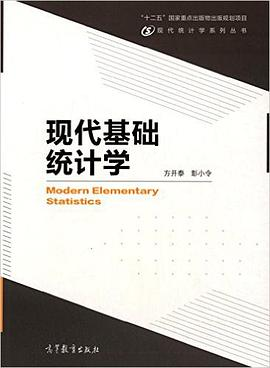

## Modern Elementary Statistics Supplementary materials

## Shiny

>Shiny is a `R` package that makes it easy to build interactive web apps straight from R. You can host standalone apps on a webpage or embed them in R Markdown documents or build dashboards. You can also extend your Shiny apps with CSS themes, htmlwidgets, and JavaScript actions.

>Shiny combines the computational power of R with the interactivity of the modern web.
> From [shiny official website](https://shiny.studio.com)

